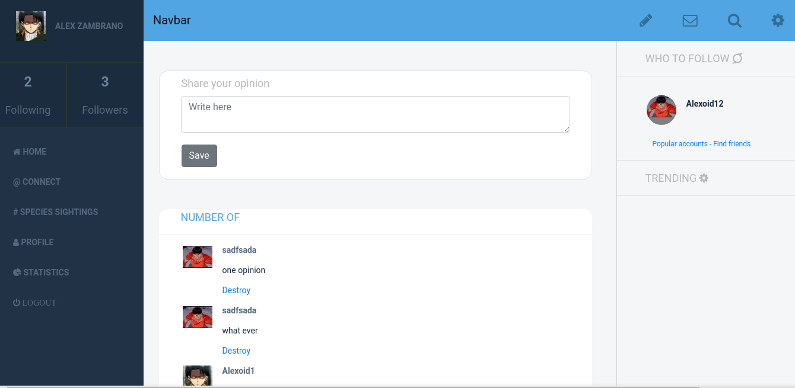
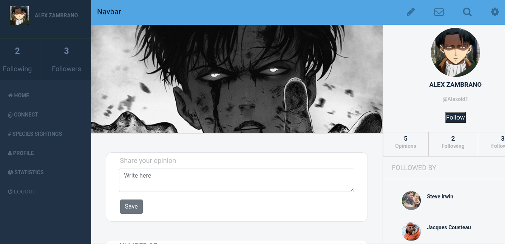
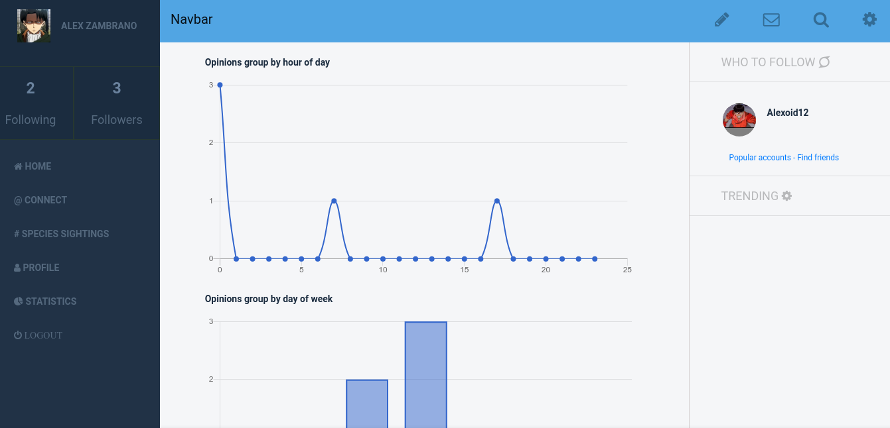
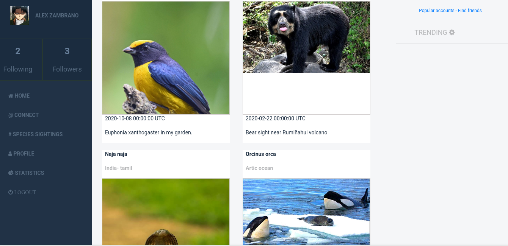

# Biologist app (Capstone project Rails)

> The main goal is create a Social media website. It's a real-world-like project, built with business specifications is based on a redesign of Twitter. You should follow the given design of the website, but you must personalize the content.

## Index

## Profile

## Charts

## Species Sightings

### Prerequisites

- Browser
- Internet
- Postgresql Install
- Ruby Install
- Rails Install

## Getting Started

- Go to (https://github.com/Alexoid1/Biologist-app) and have a look around.
- Open your Terminal.
- Clone repo
- Go to the project's root
- Type (bundle install)
- Type (rails db:create)
- Type (rails db:migrate)
- Start server (rails server)
- In your browser open: http://localhost:3000/

## Built With

- Ruby on Rails
- Capybara
- Bootstrap
- Rspec
- Postgresql

## Live Version

[Live Demo Link](https://biologistt-app.herokuapp.com/)

## Video

[Video Link](https://www.youtube.com/watch?v=0Uoi7ZlhYt8)

## Credit

- Design idea by Gregoire Vella on Behance(https://www.behance.net/gallery/14286087/Twitter-Redesign-of-UI-details)

## Authors

👤 **Pablo Alexis Zambrano Coral**

- Github: [@Alexoid1](https://github.com/Alexoid1)
- Twitter: [@pablo_acz](https://twitter.com/pablo_acz)
- Linkedin: [linkedin](https://www.linkedin.com/in/pablo-alexis-zambrano-coral-7a614a189/)

## 🤝 Contributing

Contributions, issues and feature requests and any type of feedback to improve are welcome!

## Show your support

Give a ⭐️ if you like this project!

## 📝 License

This project has license.
